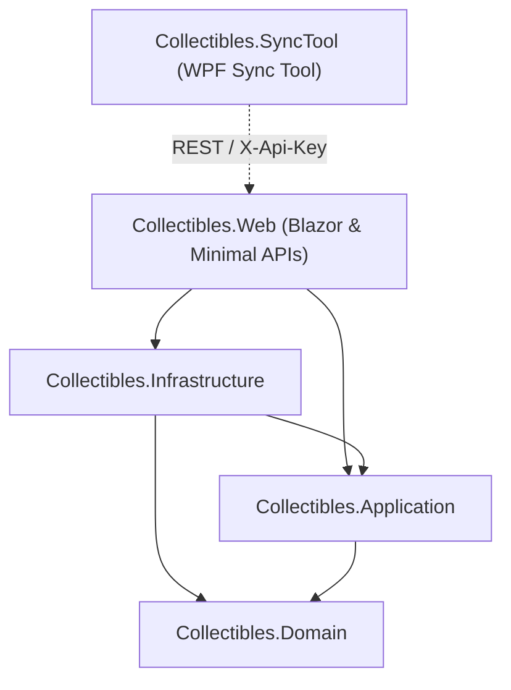

# Architecture & Design Review: Collectibles Application

A comprehensive architectural and design analysis was performed across the **Collectibles** solution (`Source/Collectibles.*`).

---

## 🏛️ 1. Solution Architecture & Layer Separation

The application follows a **Clean Architecture** (Onion Architecture) pattern with strict inward dependency management:

### Layer Breakdown

| Project / Layer | Primary Responsibility | Dependencies |
| :--- | :--- | :--- |
| **`Collectibles.Domain`** | Domain entities, value objects, domain enums, specifications, and domain event interfaces. Pure C# with zero external packages. | *None* |
| **`Collectibles.Application`** | Business use cases (CQRS Commands & Queries via MediatR), FluentValidation rules, pipeline behaviors, and resource authorization handlers. | `Collectibles.Domain` |
| **`Collectibles.Infrastructure`** | Database persistence (`ApplicationDbContext`, migrations), file storage (Azure Blob & Local), file processing (ImageSharp, FFMpegCore, PDFtoImage), email processing, password history, and Hangfire background jobs. | `Collectibles.Application`, `Collectibles.Domain` |
| **`Collectibles.Web`** | ASP.NET Core 10 Blazor Web UI (Server & WASM) + Minimal API Endpoints (`AttachmentEndpoints`, `SyncEndpoints`), middleware pipeline, and Hangfire dashboard. | `Collectibles.Infrastructure`, `Collectibles.Application`, `Collectibles.Domain` |
| **`Collectibles.SyncTool`** | Standalone WPF client application for scanning and syncing local collectible file archives to the web application. | *External client via REST API* |

---

## 💎 2. Domain Model & Dynamic Schema Design

### Entity Taxonomy & Auditability
- **Entity Base Hierarchy**:
  - `BaseEntity`: Fundamental entity contract with `Id` and unmapped `DomainEvents`.
  - `BaseAuditableEntity`: Adds automated tracking for `Created`, `CreatedBy`, `LastModified`, `LastModifiedBy`.
  - `BaseAuditableSoftDeleteEntity`: Implements soft-delete tracking (`IsDeleted`, `Deleted`, `DeletedBy`).
- **Automated Audit Pipeline**: Timestamps (`DateTime.UtcNow`) and user principal IDs (`_currentUserService.UserId`) are automatically attached inside `ApplicationDbContext.SaveChangesAsync`.

### Dynamic EAV Schema via Value Objects
- Rather than resorting to brittle Entity-Attribute-Value (EAV) database tables, dynamic item schemas are backed by strongly-typed JSON value objects:
  - `TemplateDefinition`, `FieldDefinition`, `FieldValueEntryCollection`, and `InflationAdjustedPriceValue`.
  - Encapsulates complex validation rules, data type enforcement, and historical CPI inflation calculations directly inside domain value objects.

---

## ⚡ 3. CQRS & MediatR Pattern Implementation

### Vertical Slice Feature Structure
Commands and queries are structured into feature slices under [`Source/Collectibles.Application/Features/`](file:///C:/Development/Ready%20Ok%20Retro/Collectibles/Source/Collectibles.Application/Features):
- Features: `CollectibleItems`, `Attachments`, `ContentDefinitions`, `Showcases`, `ZipUpload`, `Sync`, `QRCodes`, `Tags`, `Users`, and `Maintenance`.

### Interceptor Pipeline
- **[`ValidationBehaviour.cs`](file:///C:/Development/Ready%20Ok%20Retro/Collectibles/Source/Collectibles.Application/Behaviors/ValidationBehaviour.cs)**: Automatically executes registered `IValidator<TRequest>` FluentValidation rules before any command or query handler processes a request.
- **Explicit DTO Mappers**: Specialized mapper services (`IAttachmentMappingService`, `ICollectibleItemMappingService`) decouple internal EF Core entity graphs from external DTO contracts.

---

## 💾 4. Persistence & Blazor Concurrency Architecture

### Thread-Safe DbContext Strategy
- **Blazor Server Concurrency Solution**: In Blazor Server, component lifecycles can invoke multi-threaded or concurrent UI rendering calls. The codebase addresses this with [`ScopedApplicationDbContextFactory.cs`](file:///C:/Development/Ready%20Ok%20Retro/Collectibles/Source/Collectibles.Infrastructure/Persistence/ScopedApplicationDbContextFactory.cs):
  - Captures current user context (`CapturedCurrentUserService`).
  - Instantiates short-lived, thread-isolated `DbContext` instances on demand.

### Fluent Entity Configurations
- Entity mappings are organized cleanly into `IEntityTypeConfiguration<T>` classes in [`Infrastructure/Persistence/Configurations/`](file:///C:/Development/Ready%20Ok%20Retro/Collectibles/Source/Collectibles.Infrastructure/Persistence/Configurations).
- Includes indexed foreign keys, soft-delete filters, and unique constraints (e.g. `ApiKeyHash`).

---

## ⚙️ 5. Background Processing & Media Processing Engine

### Dual Background Architecture
1. **Hangfire Scheduler**:
   - Manages durable background queues and recurring maintenance jobs (`process-pending-emails`, `generate-missing-attachment-previews`, `cleanup-old-request-logs`, `cleanup-orphaned-zip-upload-jobs`).
   - Includes secure dashboard access via `HangfireAuthorizationFilter`.
2. **Media Processing Engine**:
   - **SixLabors ImageSharp**: High-performance image thumbnail generation and cropping.
   - **FFMpegCore**: Video thumbnail frame extraction.
   - **PDFtoImage**: PDF document page rendering.
   - **Chunked Zip Ingestion**: Multi-part ZIP archive extraction pipeline via `ZipUploadJobService`.

---

## 🔐 6. Security, Identity & Resource Authorization

- **ASP.NET Core Identity**: User authentication via standard Identity tables paired with custom password security:
  - `CustomPasswordValidator`: Blocks common passwords and user PII in passwords.
  - `PasswordHistoryService`: Prevents password reuse across previous $N$ password changes.
- **API Key Sync Authentication**: `ApiKeyAuthenticationHandler` validates `X-Api-Key` HTTP headers for remote desktop client sync (`Collectibles.SyncTool`).
- **Resource-Based Authorization**: Granular handlers (`AttachmentAuthorizationHandler`, `ShowcaseAuthorizationHandler`, `CollectibleItemAuthorizationHandler`) enforce ownership (`UserId == currentUserId`), public vs private visibility (`IsPrivate`), and share token authorization (`ShowcaseShareToken`).

---

## 🚀 7. Key Strengths & Strategic Recommendations

### Key Architectural Strengths
> [!TIP]
> 1. **Robust Layer Isolation**: Clean Architecture dependency flow is strictly maintained; domain logic is isolated from 3rd-party framework code.
> 2. **Blazor Thread Safety**: The `ScopedApplicationDbContextFactory` design pattern successfully prevents EF Core concurrent DbContext usage bugs in Blazor.
> 3. **Extensible Dynamic Schemas**: Value objects back complex collectible template definitions cleanly without relational EAV sprawl.
> 4. **Defense-in-Depth Security**: Layered approach combining API key authentication, Identity cookie security, rate-limiting middleware, and resource-based authorization.

### Strategic Recommendations for Future Evolution

> [!NOTE]
> 1. **Automated Domain Event Dispatch**:
>    Hook domain event publishing (`IMediator.Publish`) automatically into `ApplicationDbContext.SaveChangesAsync` before committing transactions, eliminating manual event dispatch in command handlers.
> 2. **Background Service Unification**:
>    Consolidate background task execution under Hangfire jobs to remove redundant standard `BackgroundService` polling loops.
> 3. **Pure Application Abstractions**:
>    Consider replacing direct `Microsoft.EntityFrameworkCore` package references in `Collectibles.Application` with custom repository or queryable abstractions to maintain 100% pure framework-agnostic application use cases.
